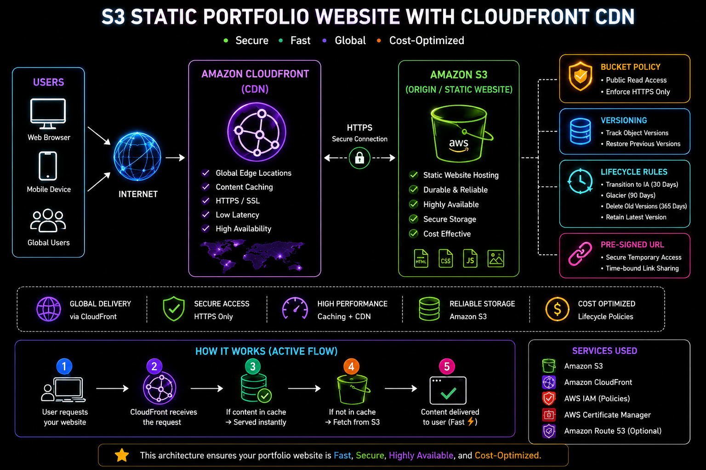
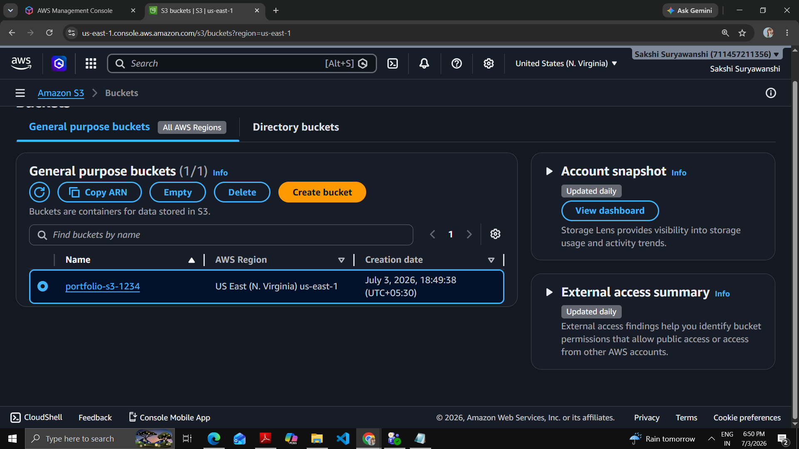
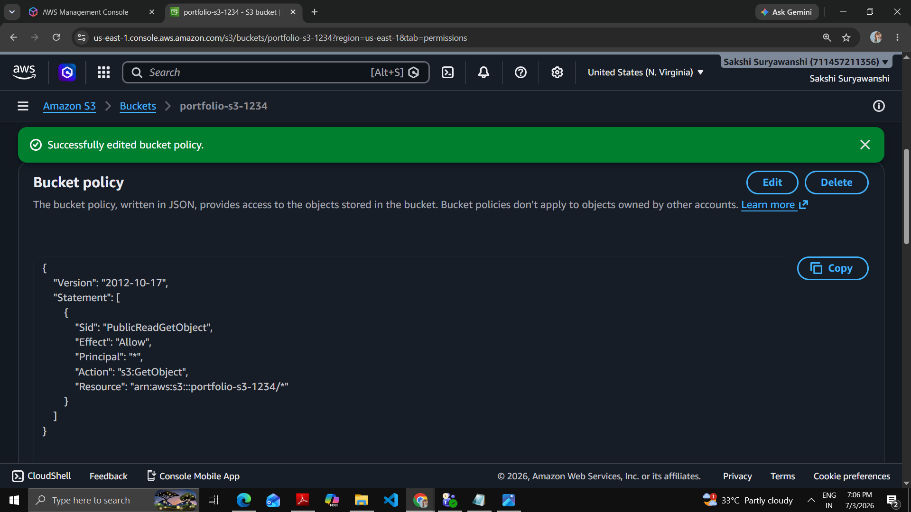
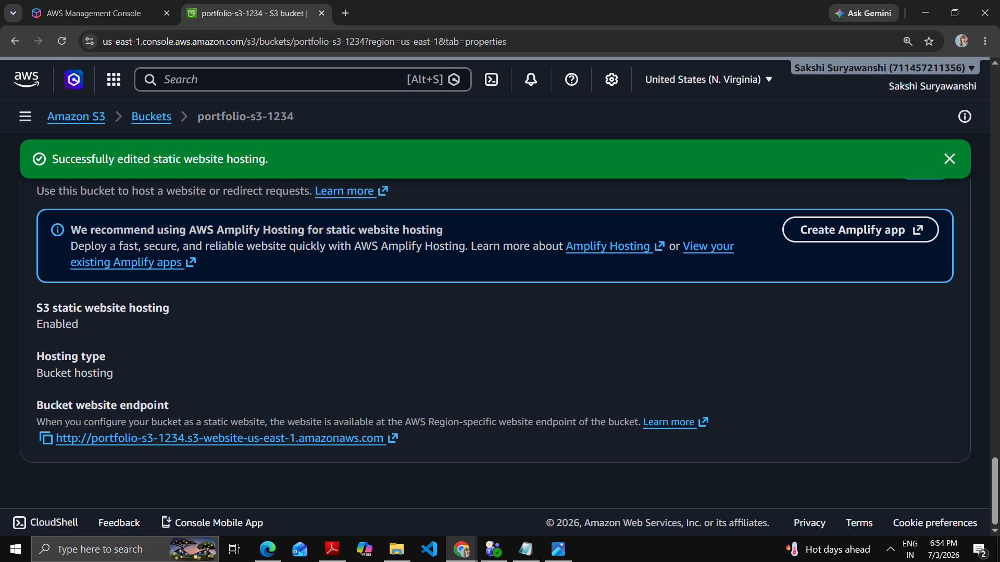
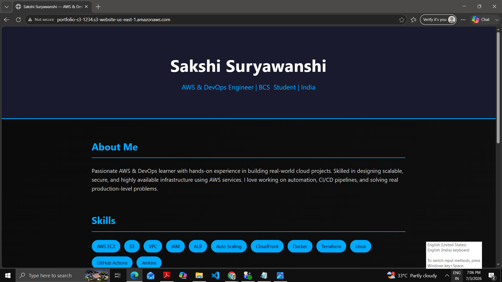
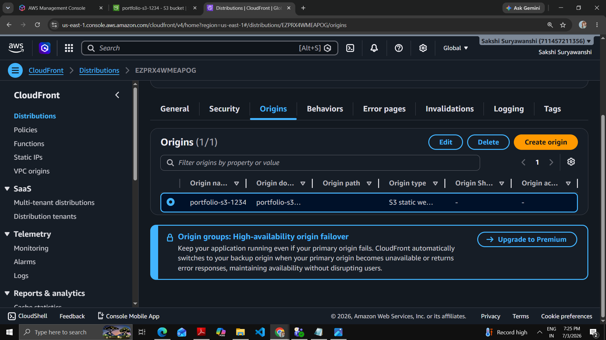
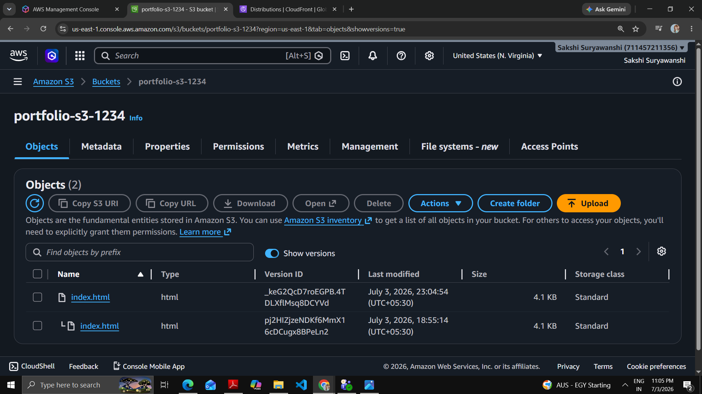
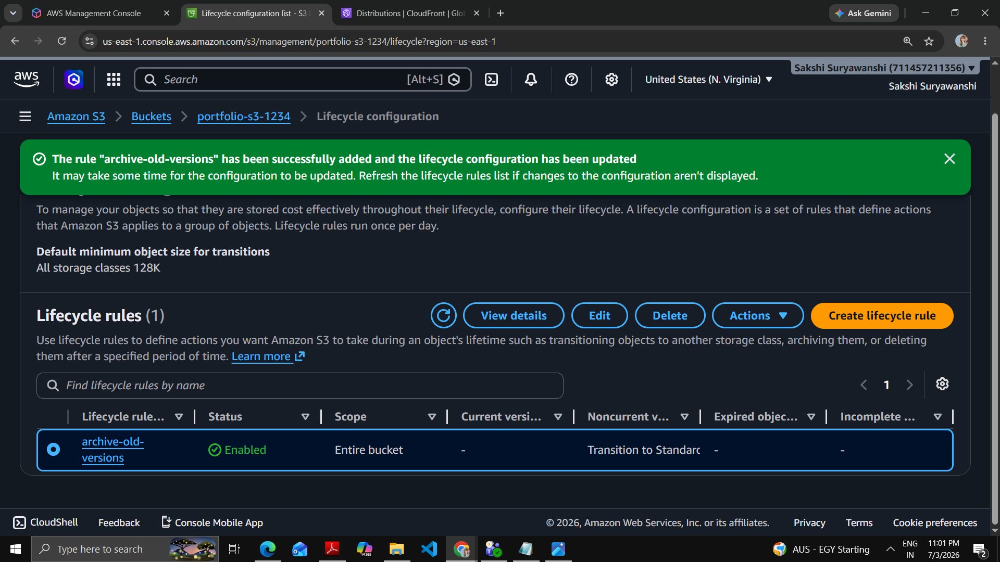
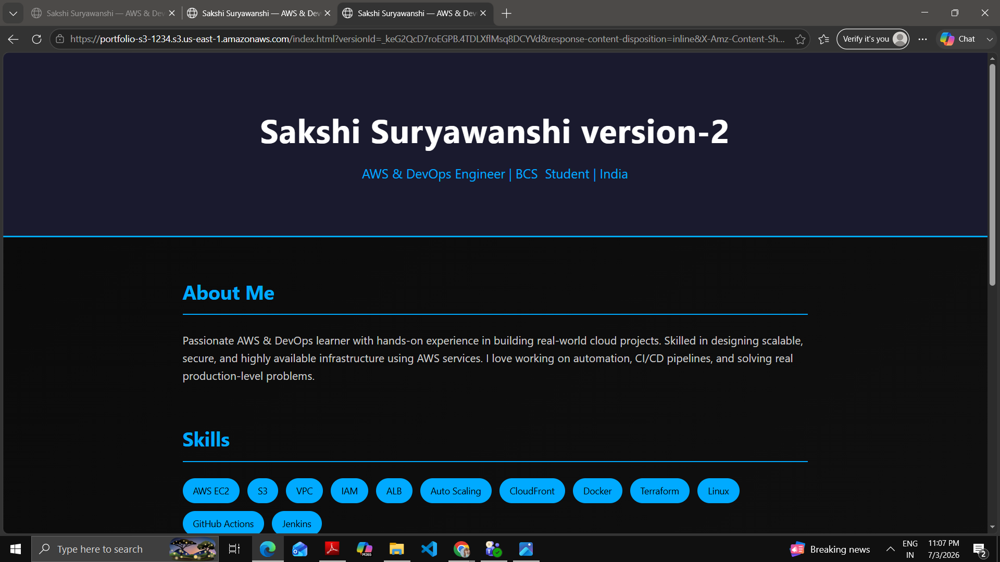
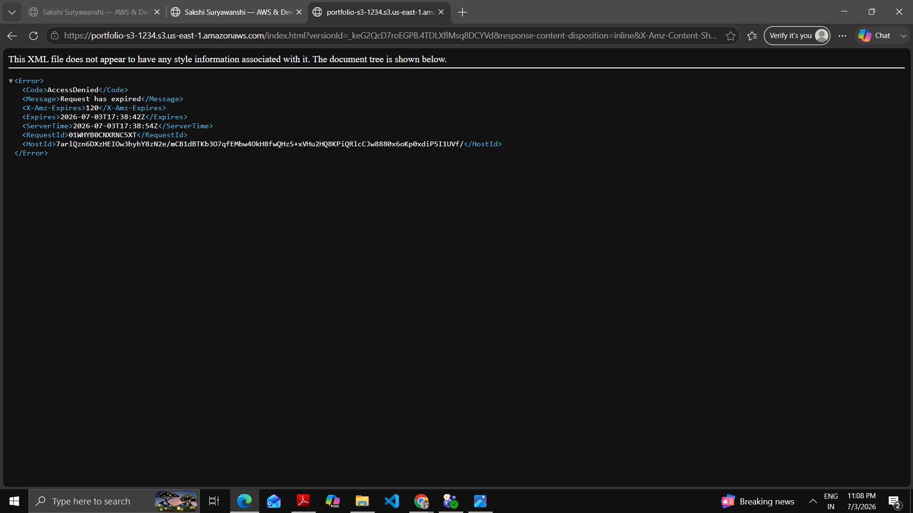

# 🚀 S3 Static Portfolio Website with CloudFront CDN

## 📌 Project Overview

This project demonstrates how to deploy a **secure, scalable static portfolio website** on AWS using Amazon S3 and CloudFront CDN.

It ensures:

* Fast global delivery
* HTTPS secure access
* Version control for safe updates
* Cost optimization using lifecycle rules

---

## 🏗️ Architecture

🌐 Users:

* Access the website through browser or mobile
* Requests are sent over the internet

⚡ CloudFront (CDN):

* Acts as a global content delivery network
* Caches content at edge locations
* Provides HTTPS and low latency

📦 S3 Bucket (Origin):

* Stores static website files (HTML, CSS)
* Serves as the origin for CloudFront

🔄 Traffic Flow:
Users → CloudFront → S3 → Response to User

---

# 📦 S3 Setup

## 🥇 Step 1: Create S3 Bucket

S3 Bucket Creation

Details:

S3 bucket is used to store static website files

It includes:

* index.html file
* Storage for website assets
* Globally accessible object storage

---

## 🥈 Step 2: Configure Bucket Policy

Bucket Policy Configuration

Details:

Bucket Policy is used to control access to S3 objects

It includes:

* Allow public read access (s3:GetObject)
* Principal set to "*"
* Resource for all objects in bucket
* HTTPS-only access enforcement

---

## 🥉 Step 3: Enable Static Website Hosting

Static Website Hosting

Details:

Static Website Hosting is used to serve website from S3

It includes:

* Enabled hosting feature
* Configured index document (index.html)
* Generated website endpoint URL
* Direct browser access

---

## 🌐 Website Live (S3 Endpoint)

Explanation:

Website is accessible using S3 website URL

🧠 What This Means
📦 S3 is hosting the website
🌐 Website is publicly accessible
🚀 Static content is served directly

🔄 Flow
Users → S3 Website Endpoint → Browser Output

---

# ⚡ CloudFront Setup

## 🥇 Step 4: Create CloudFront Distribution

Details:

CloudFront is used to improve performance and security

It includes:

* S3 website endpoint as origin
* Global edge locations
* HTTPS enabled
* Content caching

---

## 🌐 Website Live with HTTPS (CloudFront)

.png)

Explanation:

Website is accessed using CloudFront domain

🧠 What This Means
⚡ Faster loading using CDN
🔒 Secure HTTPS connection
🌍 Global availability

🔄 Flow
Users → CloudFront → S3 → Browser

---

# 🧠 Advanced Features

## 🟢 Versioning Enabled

Details:

Versioning is used to manage file changes

It includes:

* Multiple versions of same file
* Backup and recovery
* Safe updates

---

## 🟡 Lifecycle Rule (Cost Optimization)

Details:

Lifecycle rule is used to manage storage cost

It includes:

* Move to Standard-IA after 30 days
* Move to Glacier after 90 days
* Delete after 365 days
* Retain latest version

---

## 🔐 Pre-Signed URL Access

Details:

Pre-signed URL provides temporary secure access

It includes:

* Time-limited access
* Secure sharing
* No public exposure required

---

# 🎯 Final Architecture Flow

Users → CloudFront → S3 → Response

---

# 🎯 Key Outcomes

✔ Static website hosted on AWS
✔ Global CDN with low latency
✔ Secure HTTPS access
✔ Version-controlled deployment
✔ Cost-optimized storage
✔ Temporary secure access using pre-signed URLs

---

# 🎉 Project Completed Successfully

This project demonstrates a **production-level static hosting architecture using AWS**, combining performance, security, and cost optimization.

---